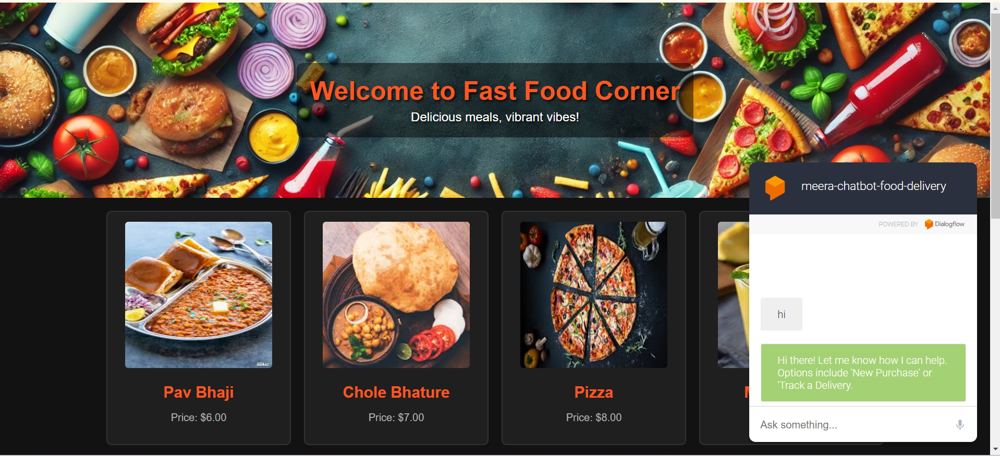

# **Order Management Chatbot**

  
*A chatbot built using Dialogflow, integrated with a webpage created using HTML and CSS, and connected to a MySQL database for order management tasks.*

---

## **Table of Contents**
1. [About the Project](#about-the-project)  
2. [Features](#features)  
3. [Tools and Technologies](#tools-and-technologies)  
4. [Architecture](#architecture)  
5. [Setup and Installation](#setup-and-installation)  
6. [How It Works](#how-it-works)  
7. [Database Schema](#database-schema)  
8. [Chatbot Intents](#chatbot-intents)  
9. [Webpage Integration](#webpage-integration)  
10. [Future Work](#future-work)  
11. [Contributing](#contributing)  
12. [Acknowledgements](#acknowledgements)  
13. [License](#license)  

---

## **About the Project**
This project features an **Order Management Chatbot** that allows users to:  
1. Place a new order.  
2. Track an existing order using its Order ID.  

The chatbot is trained with **Dialogflow**, and it interacts with a **MySQL database** to save and retrieve order details. It is integrated into a webpage built using **HTML and CSS** for seamless user interaction.

---

## **Features**
- **New Order Placement**:  
  Users can place a new order, and the details are saved to the MySQL database.  
- **Order Tracking**:  
  Users can track their order by providing an Order ID, with real-time information fetched from the database.  
- **Dialogflow-Powered Conversations**:  
  Trained with multiple intents to ensure smooth and accurate interactions.  
- **Webpage Integration**:  
  The chatbot is embedded into a user-friendly webpage for easy accessibility.

---

## **Tools and Technologies**
- **Chatbot Framework**: Dialogflow  
- **Frontend**: HTML, CSS  
- **Backend**: FastAPI(if applicable)  
- **Database**: MySQL  
- **Languages**: Python (for backend), SQL  

---

## **Architecture**
1. **Frontend (Webpage)**:  
   - User interacts with the chatbot on a webpage designed using HTML and CSS.  
2. **Chatbot (Dialogflow)**:  
   - Handles user queries and processes intents for order management.  
3. **Backend**:  
   - Connects Dialogflow to the MySQL database.  
   - Saves new orders and retrieves order tracking information.  
4. **Database (MySQL)**:  
   - Stores order details such as Order ID, product information, and order status.

---

## **Setup and Installation**
### **Prerequisites**
- Python (if backend is Flask) or Node.js (if backend is JavaScript).  
- MySQL database server.  
- Dialogflow account.  

### **Steps**
1. **Clone the Repository**:
   ```bash
   git clone https://github.com/yourusername/order-management-chatbot.git
   cd order-management-chatbot
